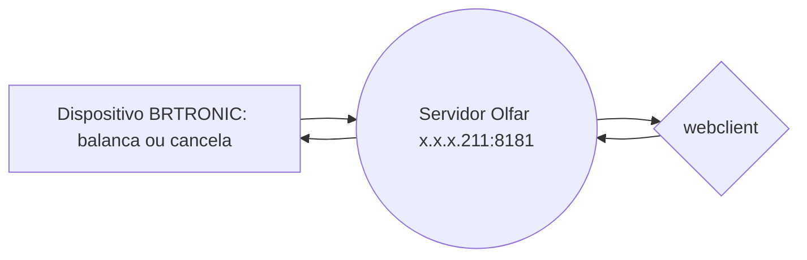

# Integração automação Olfar

Este repositorio fornece instruções detalhadas e codigo exemplo para integração com dispositivos de automação padrao **Olfar SA**. Hardware, firmware e sistemas desenvolvidos e fornecidos por **BRTRONIC - Rodrigo Daniel Zacarias ME**.

# Files

Client websocket exemplo: `./index.js`

> **Note:** pasta `./balancas/` fornece um compilado com fotos e instrucoes para ligacao e configuracao do hardware responsavel por gerenciar os dispositivos na balanca.

> **Note:** pasta `./cancelas/` fornece um compilado com fotos e instrucoes para ligacao e configuracao do hardware responsavel por controlar a cancela.

## Diagrama basico

# Data Stream

> Hardware => **Server:8181** => ClientWebSocket

> ClientWebSocket => **Server:8181** => Hardware

Conectar ao servidor pela porta `8181`. Na url de conexao, passar o parametro `/link=IP_DISPOSITIVO`

Quando a conexão for estabelecida, o servidor irá criar um canal de comunicação direto com o hardware. Este canal pode ser usado para enviar comandos e receber respostas do dispositivo remoto.

O arquivo `./indez.js`fornece um exemplo pratico de webClient bem como o envio de comandos padrões para o dispositivo remoto.

Exemplos de comandos: 

> `GS`: Retorna o status de todas IOs do hardware

> `SLW{{text}}`: Escreve texto no painel LCD

> `SS.GREEN`: Liga sinal VERDE, desliga sinal VERMELHO

> `SSGP`: Pisca sinal VERDE

> `SS.RED`: Liga sinal VERMELHO, desliga sinal VERDE

> `SSRP`: Pisca sinal VERMELHO

> `ABRE`: ABRE cancela

> `FECHA`: FECHA cancela

Consulte a lista completa de comandos para cada tipo de dispositivo